# Visualize and monitor sensor data with Zabbix

The sensor data sent from Raspberry Pi will be collected, visualized and monitored by Zabbix.

- [1. Configuration](#1-configuration)
  - [1.1. Version](#11-version)
  - [1.2. Limitations](#12-limitations)
- [2. Preparation](#2-preparation)
  - [2.1. Docker](#21-docker)
  - [2.2. Git](#22-git)
- [3. Building Kafka Broker](#3-building-kafka-broker)
  - [3.1. Deploying Materials](#31-deploying-materials)
  - [3.2. Parameter Settings](#32-parameter-settings)
  - [3.3. Running the Container](#33-running-the-container)
  - [3.4. Checking Operation](#34-checking-operation)
- [4. Building Zabbix Server](#4-building-zabbix-server)
  - [4.1. Deploying Materials](#41-deploying-materials)
  - [4.2. Running the Container](#42-running-the-container)
  - [4.3. Configuring Zabbix Server](#43-configuring-zabbix-server)
  - [4.4. Displaying Sensor Data](#44-displaying-sensor-data)
- [5. Building Zabbix Sender](#5-building-zabbix-sender)
  - [5.1. Deploying Materials](#51-deploying-materials)
  - [5.2. Parameter Settings](#52-parameter-settings)
  - [5.3. Running the Container](#53-running-the-container)
  - [5.4. Sending Test Data](#54-sending-test-data)
- [6. Appendix](#6-appendix)
  - [6.1. Monitoring Kafka Broker with Zabbix](#61-monitoring-kafka-broker-with-zabbix)

## 1. Configuration

```mermaid
flowchart LR
  subgraph C1[Raspberry Pi 1]
    S1([sensor])-.-P1(SINETStream)
  end
  subgraph C2[Raspberry Pi 2]
    S2([sensor])-.-P2(SINETStream)
  end
  subgraph S[Server]
    subgraph K[Broker node]
      B[Kafka Broker]
    end
    subgraph ZSC[Zabbix Sender node]
      KC(SINETStream)
    end
    subgraph Z[Zabbix node]
      ZS[Zabbix Server]
    end
  end
  W[Web Browser]

  P1-.->B
  P2-.->B
  B==>KC==>|Zabbix trapper|ZS-.->W
```

The server we are building here consists of 3 nodes.

- Broker node
  - Node running Kafka broker that receives sent sensor data
- Zabbix Sender node
  - Node that forwards data sent to the Kafka broker to Zabbix server
  - Converting message formats between Kafka broker and Zabbix, etc.
- Zabbix Node
  - Node running Zabbix Server
  - Zabbix Server performs visualization and monitoring, including graph display
  - Zabbix Server is the final repository of submitted data

Software components running on each node can also run on the same node.

### 1.1. Version

The version of each software component is listed below.

|Software|Version|
|---|---|
|[Apache Kafka](https://kafka.apache.org/)|3.4.0|
|[Zabbix](https://www.zabbix.com/)|6.0 LTS|

### 1.2. Limitations

The system built here is intended to show an example of a system built using SINETStream. Therefore, the Kafka broker is configured as follows with priority on simplicity.

- 1 node configuration
- No encryption of communication paths
- No authentication

When using Kafka in actual operation, please take appropriate measures as necessary, such as using a multi-node configuration.

## 2. Preparation

### 2.1. Docker

Each component to be executed on the server will be executed as a Docker container. Therefore, it is necessary to install Docker Engine or other software in advance.

#### 2.1.1. Docker Engine

Please refer to the following page to install Docker Engine. 19.03.0 or later version of Docker is required.

- [Install Docker Engine on CentOS](https://docs.docker.com/engine/install/centos/)
- [Install Docker Engine on Ubuntu](https://docs.docker.com/engine/install/ubuntu/)
- [Install Docker Engine on Debian](https://docs.docker.com/engine/install/debian/)

As noted in the installation instructions above, adding users to the `docker` group will allow them to run `docker` commands without administrative privileges. Please configure the group settings as needed.

```console
sudo gpasswd -a $USER docker
```

The following description assumes that you can execute `docker` commands without administrative privileges.

#### 2.1.2. Docker Compose

[Docker Compose](https://github.com/docker/compose) is used to manage multiple containers and container startup parameters in a configuration file.

The installation procedure for Docker Compose is shown below. Here are the installation instructions for Docker Compose v2.

```console
sudo mkdir -p /usr/local/libexec/docker/cli-plugins
sudo curl -L https://github.com/docker/compose/releases/download/v2.18.1/docker-compose-linux-x86_64 -o /usr/local/libexec/docker/cli-plugins/docker-compose
sudo chmod +x /usr/local/libexec/docker/cli-plugins/docker-compose
```

To verify that it has been installed, let's display the version.

```console
$ docker compose version
Docker Compose version v2.18.1
```

> If you are using Docker Compose v1, run with `docker-compose` instead of `docker compose`. All examples shown in this document are for Docker Compose v2; if you use v1, replace `docker-compose` with `docker-compose`. Docker Compose version 1.27.1 or higher is required.

### 2.2. Git

Zabbix is built using git command. git command should be installed on the node where Zabbix server is built, e.g. by using OS packages.

For CentOS / RHEL, run the following command.

```command
sudo yum install git
```

For Debian / Ubuntu, issue the following command: ``command $ sudo yum install git ```

```command
sudo apt install git
```

## 3. Building Kafka Broker

### 3.1. Deploying Materials

Place the files in the subdirectory `kafka/` on the node where you will build the Kafka broker.

### 3.2. Parameter Settings

Parameters of the Kafka broker are set as environment variables of the container. Container environment variables are set by creating `.env` file in the same directory as `docker-compose.yml` and describing them in that file.

#### 3.2.1. Format

`.env` is a file in which each line is formatted as "(parameter name)=(value)". An example is shown below.

```bash
BROKER_HOSTNAME=kafka.example.org
```

In this example, ``kafka.example.org`` is specified as a value for the parameter ``BROKER_HOSTNAME``.

> An example .env file can be found in [kafka/example_dot_env](kafka/example_dot_env). Use it as a template.

See [Docker Compose/Environment File#Syntax rules](https://docs.docker.com/compose/env-file/#syntax-rules) for details on the `.env` format.

#### 3.2.2. BROKER_HOSTNAME

Specifies the host name or IP address to be given to the client as the address of the KAFKA broker.

If an IP address is specified, the client must be able to access the server at that IP address. If you specify a hostname, the hostname must be resolvable and accessible via DNS or `/etc/hosts` in the client environment.

#### 3.2.3. Kafka Broker Properties

The configuration parameters for the Kafka broker can be specified as described in [Kafka Documentation - 3.1 Broker Configs](https://kafka.apache.org/documentation/#brokerconfigs). In the Confluent Kafka container used here, Kafka broker properties can be set using the container's environment variables. The environment variable name to be specified in this case is the name of the property to be set for the Kafka broker, converted using the following rules.

- Prefix the environment variable name with `KAFKA_`
- Convert to all uppercase
- Convert periods `.` to underscores `_`
- Replace hyphens `-` with a 2-letter underscore `__`.
- replace an underscore `_` with a three-letter underscore `___`

For example, the property `message.max.bytes` is specified as the environment variable `KAFKA_MESSAGE_MAX_BYTES`.

For details on how to specify environment variables, see [Confluent Kafka configuration](https://docs.confluent.io/platform/current/installation/docker/config-reference.html#confluent-ak-configuration).

### 3.3. Running the Container

Execute the following command in the directory where you placed `docker-compose.yml` on the node where you want to run Kafka.

```console
docker compose up -d
```

> Here is an example of running Docker Compose v2; if you are using v1, use `docker-compose` instead of `docker compose`.

Check the state of the container.

```console
$ docker compose ps 
NAME                COMMAND                  SERVICE             STATUS              PORTS
broker              "/etc/confluent/dock…"   broker              running             
zookeeper           "/etc/confluent/dock…"   zookeeper           running             
```

Make sure that the state (STATUS) of the `broker` and `zookeeper` containers are both `running`.

If the STATUS value is not `running`, check the container logs to determine the cause of the error.

```console
docker compose logs
```

### 3.4. Checking Operation

You can confirm that the Kafka broker is ready to use by running the test producer and consumer. For instructions on how to run each of the test programs, please review the instructions at the following links.

- Producer
  - [NumericalSensorData/Sensor/template/README](../../Sensor/template/README.en.md)
- Consumer
  - [option/Consumer/NumericalSensorData/text-consumer/README.en.md](../../../option/Consumer/NumericalSensorData/text-consumer/README.en.md)

## 4. Building Zabbix Server

### 4.1. Deploying Materials

Get materials to build Zabbix from [zabbix/zabbix-docker](https://github.com/zabbix/zabbix-docker) on GitHub. Run the following command on the node where you want to build Zabbix server.

```console
git clone https://github.com/zabbix/zabbix-docker.git -b 6.0 --depth 1
```

> The build procedure presented here assumes Zabbix server version 6.0. Therefore, we specify the `6.0` branch for material acquisition.

### 4.2. Running the Container

Zabbix server consists of three containers: database, web server (nginx) and Zabbix server itself. The Docker Compose configuration file `docker-compose-*.yaml` is provided with several different base OS images and databases.

The following base OS images are provided:

- [Alpine Linux 3.12](https://hub.docker.com/_/alpine/)
- [Ubuntu 20.04](https://hub.docker.com/_/ubuntu/)
- [Oracle Linux 8](https://hub.docker.com/_/oraclelinux/)

> CentOS 8 is no longer supported and has been replaced by Oracle Linux because the base image is out of date (see [reference](https://github.com/zabbix/zabbix-docker#base-docker-image)).

The following databases are available:

- [MySQL](https://www.mysql.com/jp/)
- [PostgreSQL](https://www.postgresql.org/)

For more information about the provided Docker Compose configuration files, see [Zabbix Documentation - Installation from containers - Docker Compose](https://www.zabbix.com/documentation/current/en/manual/installation/containers#docker-compose).

The following are the steps to start the containers that will make up the Zabbix server. The following example assumes ALpine Linux as OS and PostgreSQL as database.

```console
$ cd zabbix-docker
$ ln -s docker-compose_v3_alpine_pgsql_latest.yaml docker-compose.yaml
$ docker compose up -d
[+] Running 7/7
 ⠿ Network zabbix-docker_zbx_net_backend             Created              0.1s
 ⠿ Network zabbix-docker_zbx_net_frontend            Created              0.1s
 ⠿ Network zabbix-docker_default                     Created              0.1s
 ⠿ Container zabbix-docker-postgres-server-1         Started              1.3s
 ⠿ Container zabbix-docker-db_data_pgsql-1           Started              1.3s
 ⠿ Container zabbix-docker-zabbix-server-1           Started              2.2s
 ⠿ Container zabbix-docker-zabbix-web-nginx-pgsql-1  Started              3.4s
```

Check container status.

```console
$ docker compose ps
NAME                                     COMMAND                  SERVICE                  STATUS              PORTS
zabbix-docker-db_data_pgsql-1            "sh"                     db_data_pgsql            exited (0)
zabbix-docker-postgres-server-1          "docker-entrypoint.s…"   postgres-server          running
zabbix-docker-zabbix-server-1            "/sbin/tini -- /usr/…"   zabbix-server            running             0.0.0.0:10051->10051/tcp, :::10051->10051/tcp
zabbix-docker-zabbix-web-nginx-pgsql-1   "docker-entrypoint.sh"   zabbix-web-nginx-pgsql   running (healthy)   0.0.0.0:80->8080/tcp, 0.0.0.0:443->8443/tcp, :::80->8080/tcp, :::443->8443/tcp
```

Check that the STATUS of the containers `zabbix-docker-postgres-server-1`, `zabbix-docker-zabbix-server-1` and `zabbix-docker-zabbix-web-nginx-pgsql-1` is `running` for each container. The prefix of each container may vary depending on the directory name of the material obtained from GitHub.

Next, start Zabbix Agent container for getting node status of Zabbix server.

```console
$ docker compose up -d zabbix-agent
[+] Running 2/2
 ⠿ Volume "zabbix-docker_snmptraps"        Created                        0.0s 
 ⠿ Container zabbix-docker-zabbix-agent-1  Started                        0.9s 
$ docker compose ps zabbix-agent
NAME                           COMMAND                  SERVICE             STATUS              PORTS
zabbix-docker-zabbix-agent-1   "/sbin/tini -- /usr/…"   zabbix-agent        running
```

If you want to change Zabbix Agent to v2 container image, run the following command. This is an optional operation since Zabbix Agent v2 is not used to display sensor data.

```console
sed -i -e '/image:/s/zabbix-agent:/zabbix-agent2:/' docker-compose.yaml
docker compose up -d zabbix-agent
```

### 4.3. Configuring Zabbix Server

Log in to the started Zabbix Server and configure it.

Access `http://(hostname)` or `http://(IP address)` with a web browser from an environment where Zabbix server is accessible. You will see the following login screen.


Enter `Admin` as username and `zabbix` as password to login as an initial user.

After that, here is what you need to do:

- Modify Zabbix server address
- Configure timezone
- Configure visualization and monitoring of sensor data
  - Register templates
  - Register hosts

Description of each of these settings is given below.

#### 4.3.1. Modify Zabbix server address

Log in to Zabbix and you will see the following dashboard:


In the Problems section of the dashboard, Zabbix server says that `Zabbix agent is not available`. If you build Zabbix server using Docker container, Zabbix server and Zabbix Agent will be separate containers and you will not be able to access the agent on the local host. This is why you are seeing this error. To fix it, please follow the instructions below.

Select [Configuration] - [Hosts] from the menu on the left side of Zabbix web page. You should see a screen similar to the one below, where the Availability column is red, indicating that there is a problem with this host.


Select the link indicated by the red circle in the figure above. You will see the host configuration page as shown below.


The IP address in the Agent field of Interface is set to `127.0.0.1`. Specify `zabbix-agent` in the DNS name field and `DNS` in the Connect to field as shown in the red box above. Select `Update` button at the bottom of the screen.

After configuration, go to the dashboard (Global view). After a while, the status will be updated and the `Problems' field will disappear as shown below.


#### 4.3.2. Set Timezone

This section describes how to change the default timezone of Zabbix to Japan Standard Time.

Select [Administration] - [General] - [GUI] from the menu on the left side of the Zabbix web page. You will see a screen similar to the following

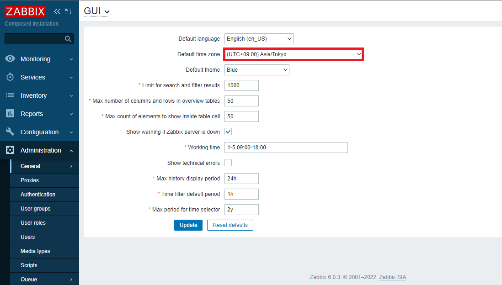

Select Asia/Tokyo as Default time zone value as shown in the red box above. Click `Update` button at the bottom of the screen to change the default time zone setting.

#### 4.3.3. Set up visualization and monitoring of sensor data

Register a template in Zabbix for visualization and monitoring of sensor data sent from the Raspberry Pi, and register the host to which the template is linked.

##### 4.3.3.1. register template

Register a template in Zabbix for sensor data sent from Raspberry Pi using SINETStream.

Select [Configuration]-[Templates] from the menu on the left side of Zabbix web page. You will see the following screen.

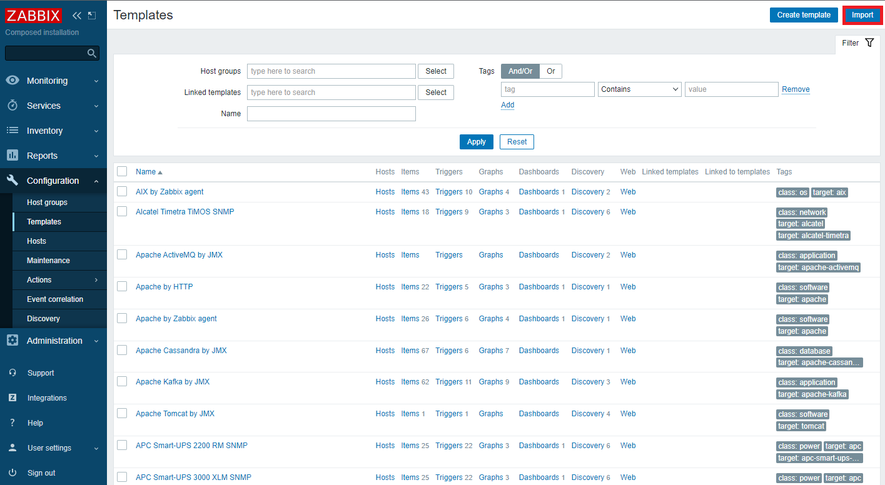

Click [Import] button shown in the red frame above to display the dialog box as shown in the figure below.

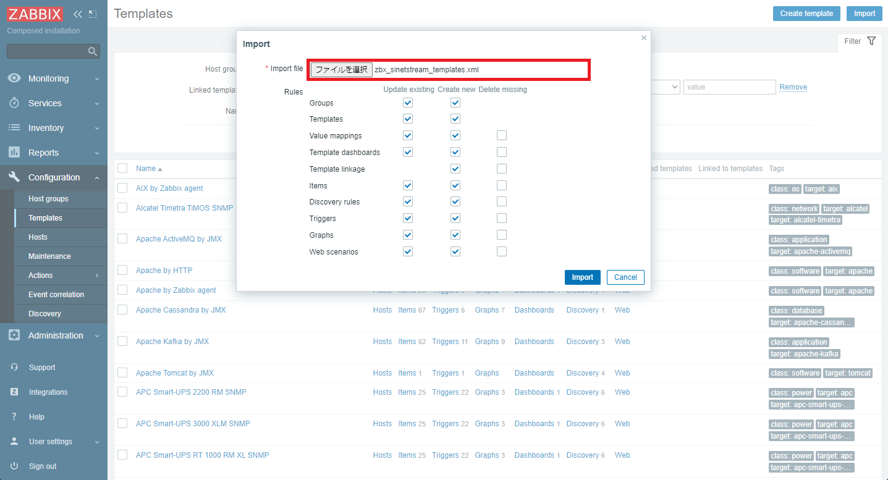

Select `zabbix/zbx_sinetstream_templates.xml` from the Import file field in the red frame above. Then click the Import button and a confirmation dialog box will appear as shown below.


Click [Import] button in the confirmation dialog to register the template.

Enter `Application`, `Contains` and `SINETStream` in the Tags field of the Filter in the template list ([Configuration]-[Templates]) and click [Apply] button. The following figure will be displayed.


You can see that the template SINETStream connector has been registered.

##### 4.3.3.2. Register host

Register hosts to Zabbix.

Display the list of host configurations ([Configuration]-[Hosts]).

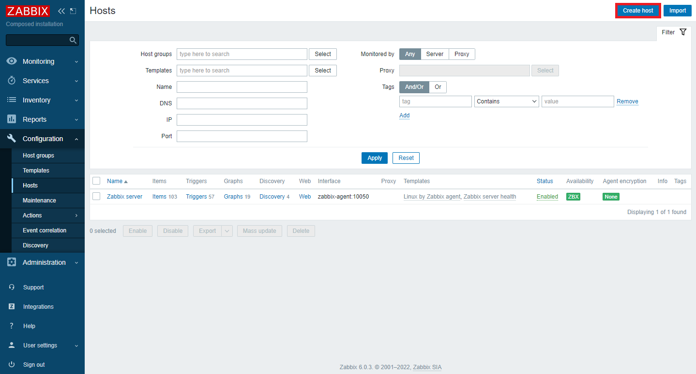

Click on [Create host] button indicated by red frame in the above figure. You will see the host registration page as shown below.

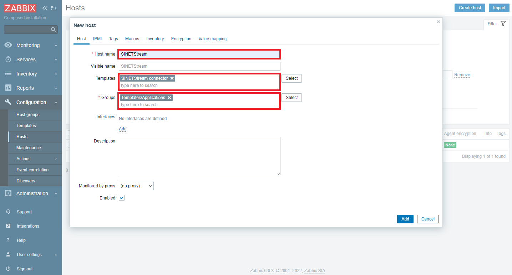

To register a host, you need to fill in the following two mandatory fields:

- Host name
- Groups

and specify the [SINETStream connector] template registered earlier in the [Templates] field.

First, enter the required fields. Enter the name of the host in the [Host name] field. This name will be used to send sensor data from Kafka broker to Zabbix. The value specified here will be set as the destination of the data later in the procedure for building Zabbix Sender node ([5.2. Parameter configuration](#52-parameter-settings)). Select a group of hosts in the [Groups] field. A host can belong to multiple groups. Please select the appropriate one according to the actual situation.

Next, select a template for the sensor data. Clicking the [Select] button in the [Templates] column will display the template selection dialog. If the host group for the template is not selected, a host group input dialog will appear as shown below.


Click [Select] button on the right side of the input field to display a list of choices, select `Templates/Applications` for the host group to which SINETStream connector template belongs (red circle in the figure below).

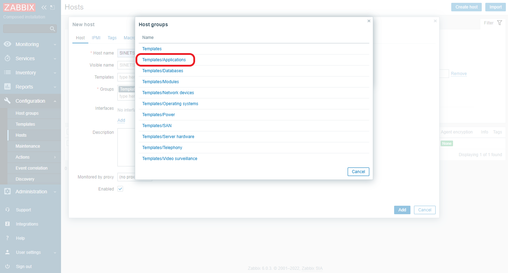

Select the host group of the template and you will see the list of templates in `Templates/Applications` (see below).


Select `SINETStream connector` template and click [Select] button. The `SINETStream connector` will be added to the [Templates] field of the host registration dialog. Finally, click the [Add] button on the host registration dialog to complete the host registration (see below).


### 4.4. Displaying Sensor Data

Check the procedure for displaying sensor data.

> At this point, you have not configured Raspberry Pi and Zabbix sender, so Zabbix will not display any sensor data information. You can check the display by submitting test data according to the procedure described in "[5.4. Send Test Data](#54-sending-test-data)".

#### 4.4.1. Template settings

This section describes the settings included in the template `SINETStream connector` for displaying sensor data.

The template includes the following settings:

- The item to which the sensor data will be sent
  - `sinetstream.connector`
- Discovery rules for sensor type and sender client name
  - Source client name: `{#SENSOR_NODE}`
  - Sensor type: `{#SENSOR}`
- Trigger to detect a break in the transmission of sensor data.

Data sent to item `sinetstream.connector` is assumed to be in JSON format as follows:

```json
{
  "temperature": 24.1,
  "humidity": 48.4,
  "node": "raspi3b"
}
```

In this JSON data, the `node` is interpreted as a value to identify the Raspberry Pi that sent the sensor data (usually the host name), and the other key values are the sensor type and its measured value. In the case of the JSON data shown in the example, the temperature sensor (`temperature`) from the host named `raspi3b` indicates a measurement of 24.1 °C and the humidity sensor (`humidity`) indicates a measurement of 48.4 %.

The discovery rule set in the template detects the source client name `{#SENSOR_NODE}` from the `node` value of the data sent to the item `sinetstream.connector` and the sensor type `{#SENSOR}` from other keys. The detected `{#SENSOR_NODE}` is used as the sensor type. An item prototype and graph prototype are defined to add new items and graphs based on the detected `{#SENSOR_NODE}` and `{#SENSOR}`. This will automatically add items and graphs based on changes in the sensor type and the Raspberry Pi from which the data is being sent.

The template defines a trigger that detects when sensor data transmission is interrupted. The template's trigger is to detect that no data has been sent to the item `sinetstream.connector` for a certain period of time. Therefore, it does not detect individual sensor data or individual hosts (Raspberry Pi) from which data is sent. If you need individual detection, please set up additional triggers for the corresponding items.

#### 4.4.2. Displaying a graph of sensor data

This section describes how to display a graph of sensor data.

Select [Monitoring] - [Hosts] from the menu on the left side of the Zabbix web page. You will see a list of registered hosts as shown in the figure below.

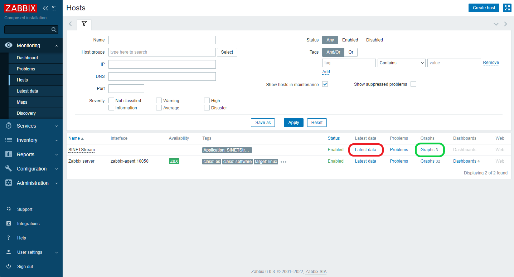

Click on the link `Graphs` in the row of the host you have registered to send sensor data to (circled in green in the figure above). You will see a graph of sensor data as shown below.

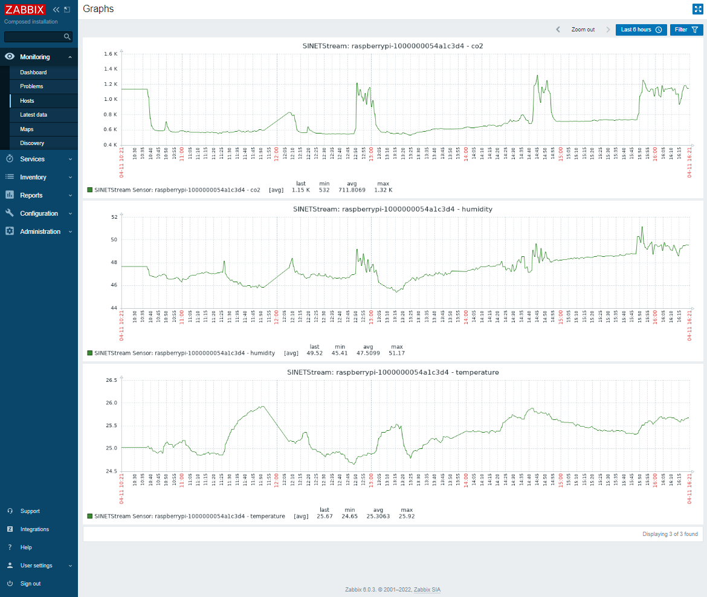

The title of each graph shows the name of the Raspberry Pi host from which the data was sent and the sensor type.

Clicking on the link `Latest data` (red circle in the previous figure) in the list of registered hosts will show the latest sensor data that has been sent (see figure below).

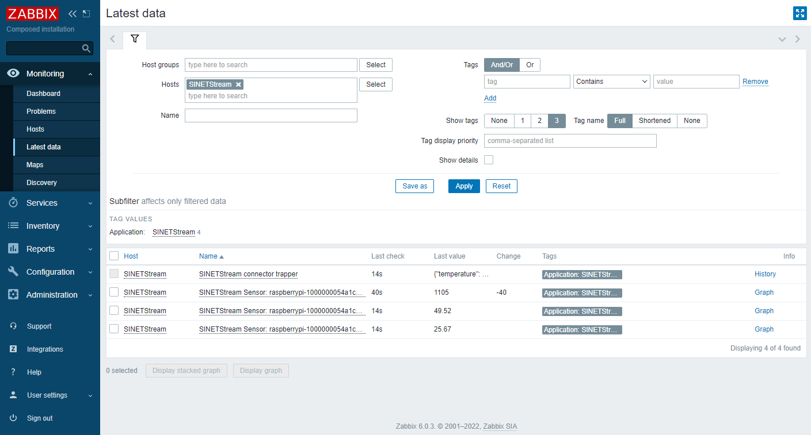

Latest data shows the latest value of each sensor automatically registered by the discovery rule, in addition to the value of the item `sinetstream.connector`, which is the destination from Kafka. You can check the history of data sent from the Raspberry Pi by clicking on the `History` link displayed in the row for the item `sinetstream.connector` on this screen (see below).

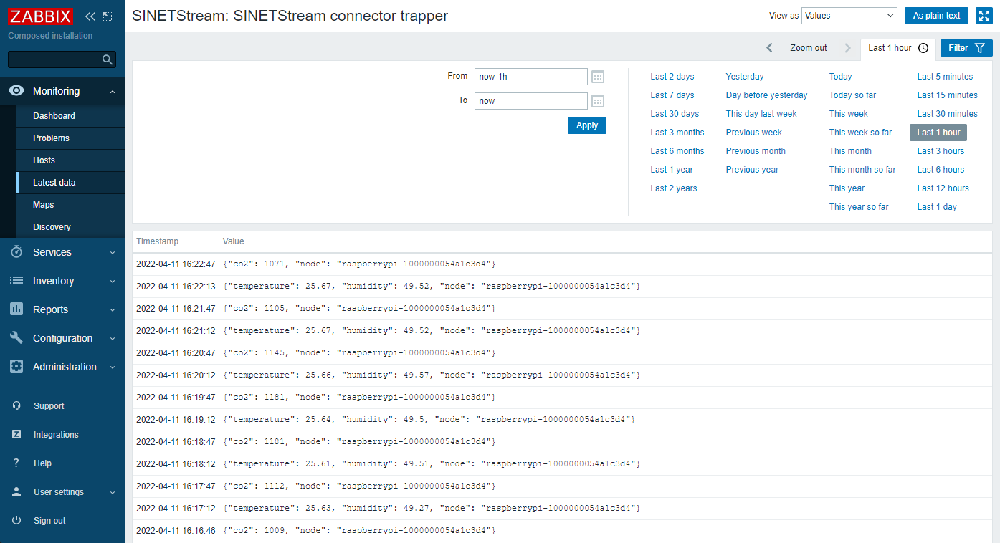

#### 4.4.3. Detecting interrupted sensor data transmission

If data transmission to the item `sinetstream.connector` is interrupted for a certain period of time, a warning will be displayed on the dashboard of Global view (see below).


The default time interval before the trigger detects missed data is 10 minutes. The time until detection can be changed by setting value in `{$SINETSTREAM_WARNING_TIME}` macro.

## 5. Building Zabbix Sender

### 5.1. Deploying Materials

Place files in subdirectory `zabbix-sender/` on the node where Zabbix sender will be built.

### 5.2. Parameter Settings

```mermaid
flowchart LR
  subgraph B["Kafka broker<br><br><br>BROKER_HOSTNAME"]
    ST([KAFKA_TOPIC])
  end
  ZS["Zabbix Sender<br>Container"]
  subgraph Z["Zabbix server<br><br><br>ZABBIX_ADDR"]
    ZH([Zabbix Host])
  end

  ST==>|SINETStream|ZS==>|Zabbix trapper|ZH
```

Specify the following parameters in the file `.env` that sets environment variables for the Docker container. In `.env`, specify values in the format `{environment variable name}={parameter value}`.

| Parameter                                                                                                                    | Environment variable name | Parameter value in the example operation |
|------------------------------------------------------------------------------------------------------------------------------|---------------------------|------------------------------------------|
| Kafka broker address<br>Value set in "[3.2.2. BROKER_HOSTNAME](#322-broker_hostname)"                                        | `BROKER_HOSTNAME`         | `kafka.example.org`                      |
| Kafka topic name<br> Topic name specified in"[Sensor/README.en.md](../../Sensor/README.en.md#32-configuration-file)"         | `KAFKA_TOPIC`             | `sinetstream.sensor`                     |
| Zabbix server address<br> hostname or IP address                                                                             | `ZABBIX_ADDR`             | `zabbix.example.org`                     |
| Name of host to be registered as target of Zabbix monitoring<br>Value set in "[4.3.3.2. Register host](#4332-register-host)" | `ZABBIX_HOST`             | `SINETStream`                            |

The operation procedure is as follows.

```console
$ touch .env
$ echo "BROKER_HOSTNAME=kafka.example.org" >> .env
$ echo "KAFKA_TOPIC=sinetstream.sensor" >> .env
$ echo "ZABBIX_ADDR=zabbix.example.org" >> .env
$ echo "ZABBIX_HOST=SINETStream" >> .env
$ cat .env
BROKER_HOSTNAME=kafka.example.org
KAFKA_TOPIC=sinetstream.sensor
ZABBIX_ADDR=zabbix.example.org
ZABBIX_HOST=SINETStream
```

### 5.3. Running the Container

Start Kafka container.

```console
docker compose up -d
```

The first time you start the container, it will take some time to complete the startup because the container image is being built. After launching, check the state of the container.

```console
$ docker compose ps
NAME                    COMMAND                  SERVICE             STATUS              PORTS
sender-zabbix-sender-1  "/bin/sh -c './consu…"   zabbix-sender       running   
```

Make sure that the STATUS of the container is `running`.

If you specify a hostname (not an IP address) as the `BROKER_HOSTNAME` value in the `.env` of the Kafka broker, Kafka Connect must be able to resolve the name of the host in its environment. If you specify a hostname that is not registered in DNS, etc. as `BROKER_HOSTNAME`, please make sure to enable name resolution for the Kafka broker by specifying [extra_hosts](https://docs.docker.com/compose/compose-file/compose-file-v3/#extra_hosts) in `docker-compose.yml`. An example of specifying extra_hosts in `docker-compose.yml` is shown below with the change diff. In this example, an entry for the Kafka broker `kafka.example.org` with IP address `192.168.1.100` is registered in `extra_hosts`.

```diff
@@ -5,3 +5,5 @@
     network_mode: host
     restart: always
     env_file: .env
+ extra_hosts:
+ - "kafka.example.org:192.168.1.100"
```

### 5.4. Sending Test Data

By running the test producer, you can send test data to the Kafka broker and check the behavior of the server side such as Zabbix, etc. It is recommended to check with the test program before sending the actual sensor data from the Raspberry Pi.

For instructions on how to run the test program, please refer to the following link.

- [NumericalSensorData/Sensor/template/README](../../Sensor/template/README_en.md)

> In the test program, random values are sent instead of actual sensor readings. Therefore, the sensor type of the sent data is named `random`.

## 6. Appendix

### 6.1. Monitoring Kafka Broker with Zabbix

```mermaid
flowchart LR
  subgraph K[Kafka]
    B[Kafka Broker]
  end
  subgraph Z[Zabbix]
    ZS(Zabbix Server)
    ZJG(Zabbix Java gateway)
  end
  W[Web Browser]

  B==>|JMX|ZJG===ZS-.->W
```

The template [Apache Kafka by JMX](https://www.zabbix.com/integrations/kafka) provided by Zabbix can be used to monitor Kafka broker from Zabbix. This section describes the configuration procedure.

> This configuration is not directly related to visualization or monitoring of sensor data. It is therefore an optional setting.

The main configuration steps are as follows:

1. Start the [Java gateway](https://www.zabbix.com/documentation/current/en/manual/concepts/java) container.
2. Register Kafka broker as a host to be monitored by Zabbix.

#### 6.1.1. Prerequisites

Zabbix server will be monitoring Kafka broker via JMX, so it is necessary to enable communication between the two. The Kafka broker built here can access JMX on TCP port 9101, so if you are building Zabbix and Kafka on different nodes, configure firewalls and other settings to allow communication.

#### 6.1.2. Start Java gateway container

If you want to monitor Zabbix Server via JMX, you need to start a service called [Zabbix Java gateway](https://www.zabbix.com/documentation/current/en/manual/concepts/java). Here we will start Java gateway using [zabbix/zabbix-java-gateway](https://hub.docker.com/r/zabbix/zabbix-java-gateway) container image.

To start the container, execute the following command in the directory where you have placed `docker-compose.yaml` on the node where you have built Zabbix server.

```console
$ docker compose up -d zabbix-java-gateway
[+] Running 1/1
 ⠿ Container zabbix-docker-zabbix-java-gateway-1  Started     
```

Check the state of the container, making sure that the STATUS value is `running`.

```console
$ docker compose ps zabbix-java-gateway    
NAME                                  COMMAND                  SERVICE               STATUS              PORTS
zabbix-docker-zabbix-java-gateway-1   "docker-entrypoint.s…"   zabbix-java-gateway   running
```

#### 6.1.3. Register Kafka broker as a host to be monitored by Zabbix

Register Kafka broker as a host to be monitored by Zabbix server.

Display the list of host configurations ([Configuration]-[Hosts]) and click on [Create host] button to display the host registration window (see below).

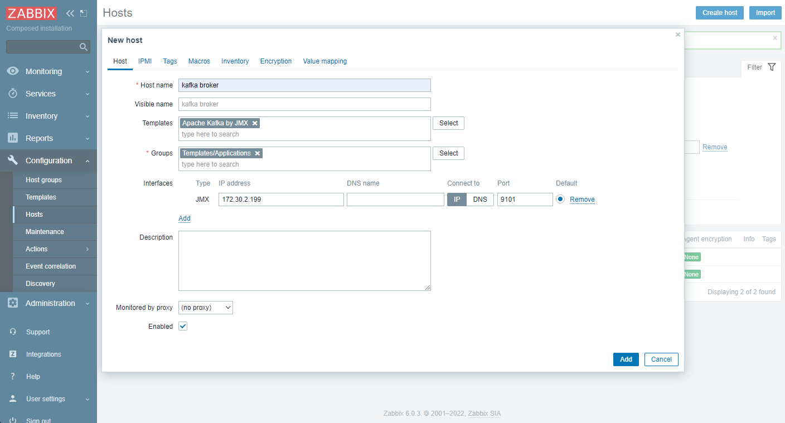

Click "Add link" in the "Interfaces" field and select `JMX` to display a field for specifying JMX parameters. Enter the address of the Kafka broker set in "[3.2.2. BROKER_HOSTNAME](#322-broker_hostname)" in the IP address or DNS name field of the input field. Also, enter `9101` in the JMX port number field.

[Click the [Select] button in the [Templates] field to select a template. Select `Apache Kafka by JMX`.

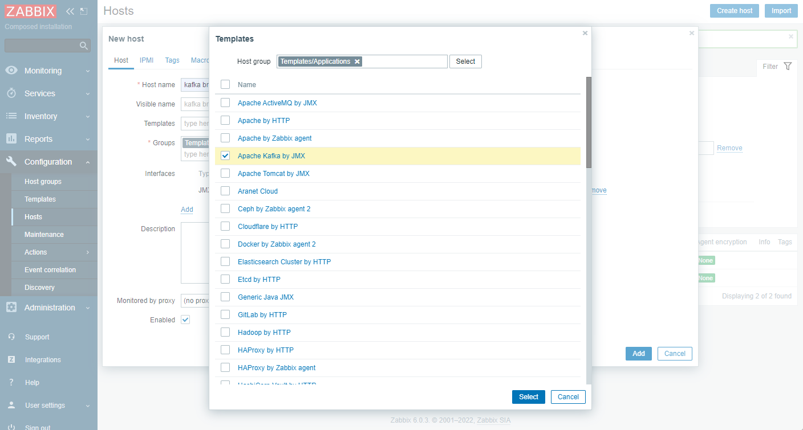

If the registration is successful, a line corresponding to the Kafka broker will be added (circled in red below).

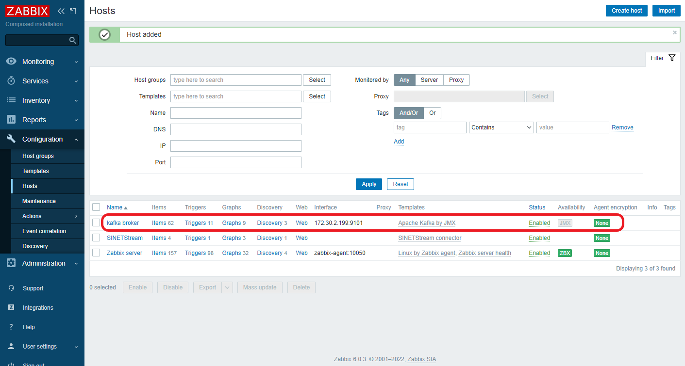

You can check the status of Kafka broker from [Monitoring]-[Hosts].
