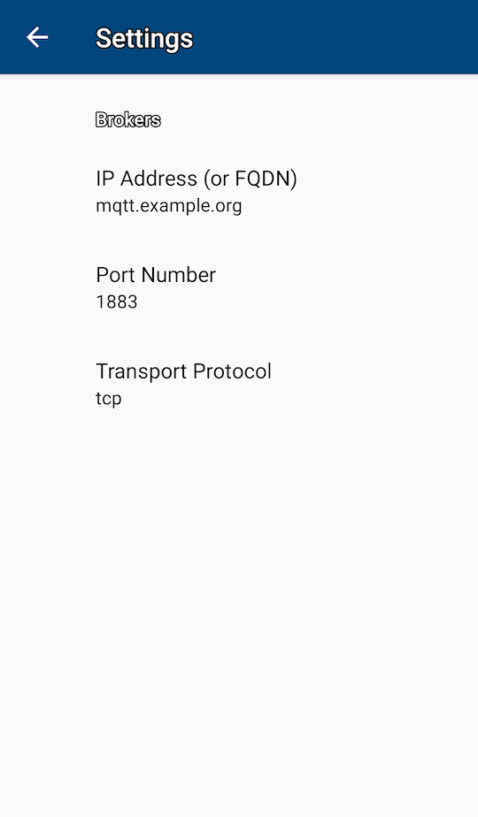
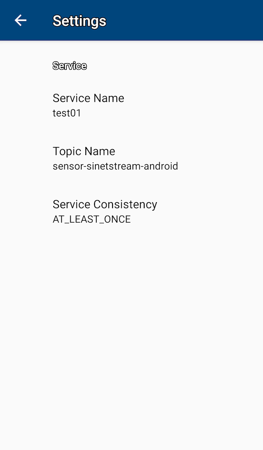
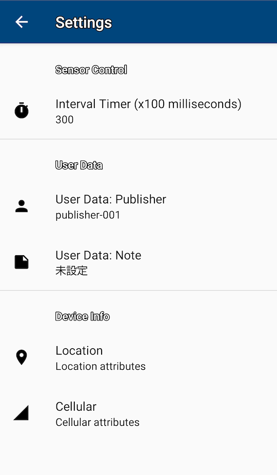
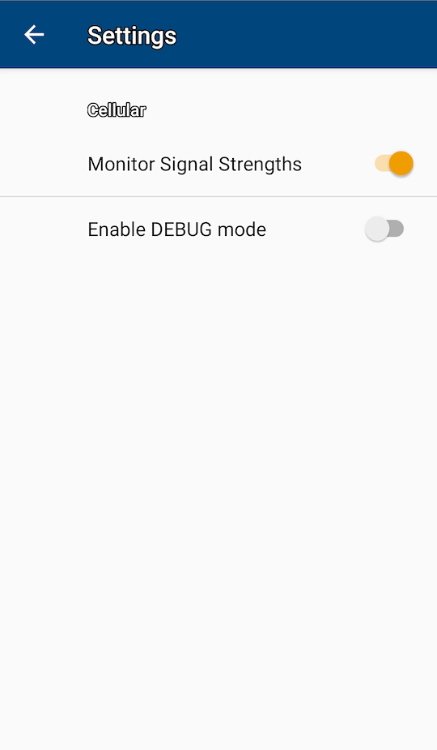
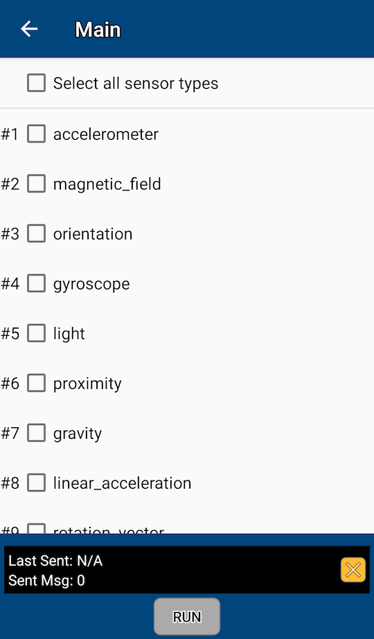

# Androidのセンサーデータをサーバに送信する

## 1. 概要

AndroidのセンサーデータをMQTTブローカに送信するアプリ[sinetstream-android-sensor-publisher](https://github.com/nii-gakunin-cloud/sinetstream-android-sensor-publisher)の設定手順を示します。

### 1.1. システム構成

システム構成を次図に示します。Android端末の各種センサーの計測値をMQTTブローカに送信します。

```mermaid
flowchart LR
  subgraph S1[server]
    subgraph N["NATS"]
      TI(["sensor data topic"])
    end
  end
  subgraph A["Android"]
    C["sinetstream-android-\nsensor-publisher"]
    C==>|MQTT|TI
  end
```

### 1.2. 事前準備

センサーデータを送信するSINETStreamのサンプルアプリ[sinetstream-android-sensor-publisher](https://github.com/nii-gakunin-cloud/sinetstream-android-sensor-publisher)をAndroid端末にインストールして下さい。アプリのインストール手順については「[Androidサンプルアプリケーションの導入](https://www.sinetstream.net/docs/tutorial-android/TUTORIAL-android-install.html)」を参照して下さい。

## 2. 設定手順

[01-setup-android-sensor-data.md](../../Server/01-setup-android-sensor-data.md)で構築した可視化サーバにセンサーデータを送信するために必要となるアプリの設定手順を説明します。

ここでは以下に関するパラメータの設定を行います。

* ブローカに関するパラメータ
* 送信先トピック名
* publisher名

> アプリの設定方法や操作に関する詳細な情報については「[チュートリアル - ANDROID-STEP2](https://www.sinetstream.net/docs/tutorial-android/TUTORIAL-android-step2.html)」などを参照してください。

### 2.1. ブローカの設定

データの送信先となるMQTTブローカに関するパラメータの設定を行います。ここでは以下のパラメータを設定します。

* MQTTブローカのホスト名(IPアドレス)
* MQTTブローカのポート番号

Androidのアプリを初めて起動すると次図のような画面が表示されます。

`Settings`ボタンを選択して下さい。次図に示す画面に遷移します。

`SINETStream`を選択して下さい。次図に示す画面に遷移します。

`Manual Configuration`を選択して下さい。次図に示すSINETStream設定画面に遷移します。

`Brokers`を選択して下さい。次図に示すブローカ設定画面に遷移します。

[IP Address (or FQDN)]にMQTTブローカのホスト名またはIPアドレスを設定して下さい。 ポート番号にMQTTブローカのポート番号を設定して下さい。

### 2.2. トピック名の設定

データの送信先となるトピック名を設定します。

ブローカ設定画面から一つ戻りSINETStream設定画面を表示して下さい。前節からの継続操作ではなくアプリの先頭画面から選択する場合は[Settings]-[SINETStream]-[Manual Configuration]の順に選択してください。

`Service`を選択してサービス設定画面を表示して下さい。

`Topic Name`にセンサーデータの送信先となるトピック名を設定して下さい。ここで設定する値はサーバを構築する際に指定した値と一致している必要があります。

また`Service Name`に適当な名前を設定して下さい。`Service Name`に指定する値はアプリ内での表示にのみ使用されるため任意の値を設定できます。

### 2.3. Publisherの設定

Publisher名を設定します。ここで設定した値は可視化サーバでどのAndroid端末から送信されたデータであるかを識別するために利用されます。複数のAndroid端末からデータを送信する場合はそれぞれ異なる値を設定して下さい。

センサー設定画面を表示します。アプリの先頭画面からは[Settings]-[Sensors]の順で選択して下さい。前節から続けて操作している場合は、サービス設定画面から３階層戻り[Sensors]を選択して下さい。

`User Data: Publisher`の項目にPublisher名を設定して下さい。

### 2.4. その他の設定

送信するセンサーデータには送信時の位置情報、セルラー情報を付加することができます。

送信データに位置情報を追加する場合はセンサー設定画面([Settings]-[Sensors])で`Location`を選択して下さい。次の画面が表示されます。

`Track Geological Location`を選択することにより位置情報が追加されるようになります。

セルラー情報を追加する場合はセンサー設定画面([Settings]-[Sensors])で`Cellular`を選択して下さい。次の画面が表示されます。

`Monitor Signal Strengths`を選択することによりセルラー情報が追加されるようになります。

### 2.5. センサーデータの送信

センサーデータの送信を行います。アプリの先頭画面で`Run`ボタンを選択して下さい。次図に示す画面が表示されます。

計測対象とするセンサーを選択した後に`Run`ボタンを選択するとセンサーデータの送信が開始されます。
