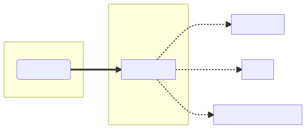

# Building a Kafka broker

Build a [Kafka broker](https://kafka.apache.org/) that is responsible for passing data acquired by the Raspberry Pi's camera, sensors, etc. to and from visualization tools such as Viewer and Zabbix/Grafana.


<!--
```mermaid
flowchart LR
  subgraph R[Raspberry Pi]
    WR(SINETStream)
  end
  subgraph S[Server]
    B[Kafka Broker]
  end
  V1["VideoViewer"]
  V2["Zabbix"]
  V3["Grafana+Elasticsearch"]
  WR==>B
  B-.->V1
  B-.->V2
  B-.->V3
```
-->

## 1. About the configuration

The Kafka broker built by the procedure shown here has the following configuration.

* No encryption in the communication channel
* No authentication in the broker
* 1 node configuration

## 2. Preparation

### 2.1. Docker

The Kafka broker runs in a Docker container. Therefore, it is necessary to install Docker Engine or other software in advance.

#### 2.1.1.

Please install Docker Engine by referring to "[Install Docker Engine](https://docs.docker.com/engine/install/)" etc. Docker version 19.03.0 or higher is required.

#### 2.1.2. Docker Compose

[Docker Compose](https://github.com/docker/compose) is used to manage multiple containers at once. Docker Compose is a tool that facilitates management of containers by describing the startup parameters, etc. in the configuration file `docker-compose.yml`. Please refer to the article "[Where to get Docker Compose - Linux](https://github.com/docker/compose#linux)" to install Docker Compose. Docker Compose version 1.27.1 or higher is required.

### 2.2. Deploying Materials

Place the files in this directory on the node where you will build the Kafka broker.

## 3. Setting Parameters

Parameters of the Kafka broker are set as environment variables of the container. Container environment variables are set by creating `.env` file in the same directory as `docker-compose.yml` and writing in that file.

### 3.1. Formatting

The format of the `.env` file is as follows: `.env` is a file in which each line is formatted as "(parameter name) = (value)". An example is shown below.

```
BROKER_HOSTNAME=kafka.example.org
KAFKA_MESSAGE_MAX_BYTES=20971520
```

In this example, for the parameters `BROKER_HOSTNAME` and `KAFKA_MESSAGE_MAX_BYTES`, the values are `kafka.example.org` and `20971520`, respectively.

See [Docker Compose/Environment File#Syntax rules](https://docs.docker.com/compose/env-file/#syntax-rules) for details on the `.env` format.

### 3.2. BROKER_HOSTNAME

Specify the hostname or IP address to be given to the client as the address of the KAFKA broker.

If an IP address is specified, the client must be able to access the server at that IP address. If a hostname is specified, the hostname must be resolvable and accessible via DNS or `/etc/hosts` in the client environment.

### 3.3. Kafka Broker Properties

The configuration parameters for the Kafka broker can be specified as described in [Kafka Documentation - 3.1 Broker Configs](https://kafka.apache.org/documentation/#brokerconfigs). In the Confluent Kafka container used here, Kafka broker properties can be set using the container's environment variables. The environment variable name to be specified in this case is the name of the property to be set for the Kafka broker, which is converted by the following rules.

* Prefix the environment variable name with `KAFKA_`
* Convert to all uppercase
* Convert periods `. ` to underscores `_`
* Replace hyphens `-` with a 2-letter underscore `__`.
* replace an underscore `_` with a three-letter underscore `___`

For example, the property `message.max.bytes` is specified as the environment variable `KAFKA_MESSAGE_MAX_BYTES`.

For details on how to specify environment variables, see [Confluent Kafka configuration](https://docs.confluent.io/platform/current/installation/docker/config-reference.html#confluent-ak-configuration).


## 4. Execution

Run the following command in the directory where you placed ``docker-compose.yml``.

```console
$ docker compose up -d
```

> Here is an example of running Docker Compose v2; if you are using v1, use `docker-compose` instead of `docker compose`.

Check the state of the container:

```console
$ docker compose ps 
NAME                COMMAND                  SERVICE             STATUS              PORTS
broker              "/etc/confluent/dock…"   broker              running             
zookeeper           "/etc/confluent/dock…"   zookeeper           running             
```

Make sure that the state (STATUS) of the `broker` and `zookeeper` containers are both `running`.

If the STATUS value is not `running`, check the container logs to determine the cause of the error.

```console
$ docker compose logs
```